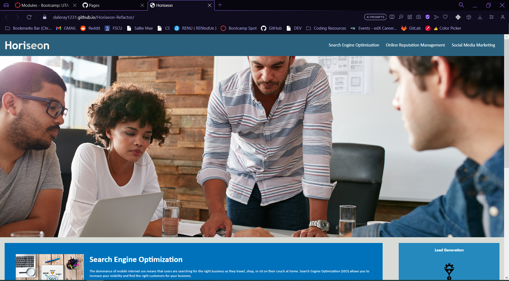

# Horiseon

## Table of Contents

- [About](#about)
- [Features](#features)
- [Getting Started](#getting-started)
- [Usage](#usage)
- [Contributing](#contributing)
- [License](#license)

## About

Optimize website for search engines and allow for easy accessability.

## Features

List the key features and functionalities of your project. You can use bullet points for this section.

## Getting Started

Provide instructions on how to set up the project locally. Include any prerequisites, installation steps, and configuration that might be needed.

## Usage

Provide examples or instructions on how to use your project. You can include code snippets, screenshots, or even GIFs to showcase the usage.

## Contributing

Explain how others can contribute to your project. This could include guidelines for pull requests, coding standards, and how to report issues.

## License

This project is licensed under the [MIT License](LICENSE).

https://github.com/coding-boot-camp/urban-octo-telegram

---
[Github Link](daleray1231.github.io/class_work)

<!-- # User Story
AS A marketing agency  

I WANT a codebase that follows accessibility standards  

SO THAT our own site is optimized for search engines  

# Acceptance Criteria
GIVEN a webpage meets accessibility standards  

WHEN I view the source code  

THEN I find semantic HTML elements  

WHEN I view the structure of the HTML elements  

THEN I find that the elements follow a logical structure   
independent of styling and positioning

WHEN I view the image elements

THEN I find accessible alt attributes  

WHEN I view the heading attributes  

THEN they fall in sequential order  

WHEN I view the title element  

THEN I find a concise, descriptive title   -->
